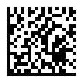

pyStrich
========
pyStrich is a Python module to generate 1D and 2D barcodes. Currently it
supports

 * code39
 * code128
 * ean13
 * datamatrix
 * qrcode

Available from PyPI: https://pypi.python.org/pypi/pyStrich
 
[](https://travis-ci.org/mmulqueen/pyStrich)

Usage
-----
The interface of the different encoders is fairly straightforward:

```python
from pystrich.datamatrix import DataMatrixEncoder
encoder = DataMatrixEncoder("This is a DataMatrix.")
encoder.save( "sample_barcodes/datamatrix_test.png" )
print(encoder.get_ascii())
```


Relevant imports are:

```python
from pystrich.code39 import Code39Encoder
from pystrich.code128 import Code128Encoder
from pystrich.datamatrix import DataMatrixEncoder
from pystrich.ean13 import EAN13Encoder
from pystrich.qrcode import QRCodeEncoder
```

Background
----------
pyStrich is a fork of huBarcode module with modifications to support Python 3 (amongst other changes). pyStrich
only supports encoding not decoding.

[huBarcode](https://github.com/hudora/huBarcode) was developed by [HuDoRa](http://www.hudora.de/en/) from at least 2007, the project does not seem to have been
active since late 2013. [Method B Ltd](http://method-b.uk) has forked it to provide Python 3 support and facilitate
future development. Thank you to the folks at HuDoRa for doing most of the hard work, porting was the easy part.

License
-------
If you worry about copyright you might consider this Software BSD-Licensed.
If you are still worried, you might consider it GPL1/2/3 compatible.
But don't worry. If you need something formal:
The code is available under the Apache License, Version 2.0.
